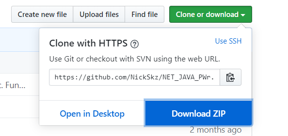

# COVID-19 Statistics App

COVID-19 Statistics App is a Desktop application, which provides live coronavirus data from Poland and all It's neighbouring countries. The app uses free thevirustracker.com API to get fresh epidemic information. Our app is a WPF .NET Core 3.1 application, so you can freely run it on Windows, Linux or macOS.

## Functionality

## Installation

To get COVID-19 Statistics App on your PC, clone this repository or download folder as a zip file.   

  

## Authors

## Licence

